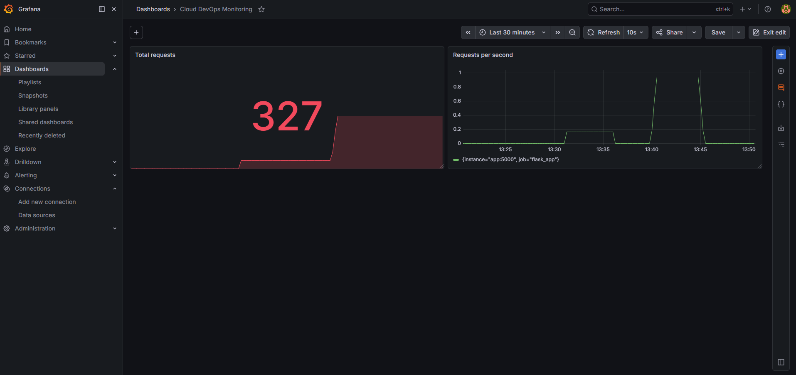
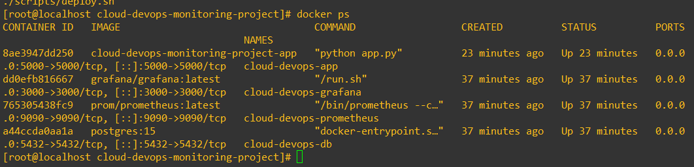
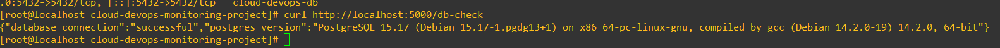
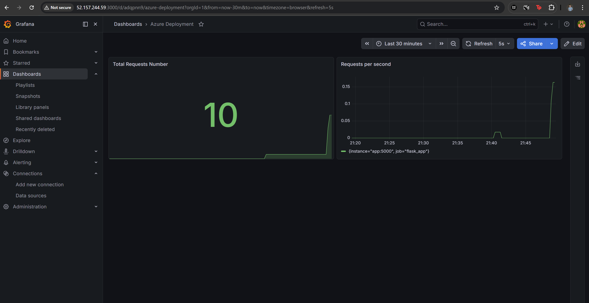
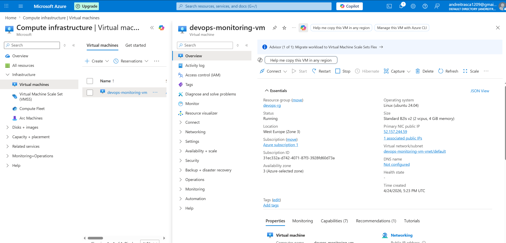
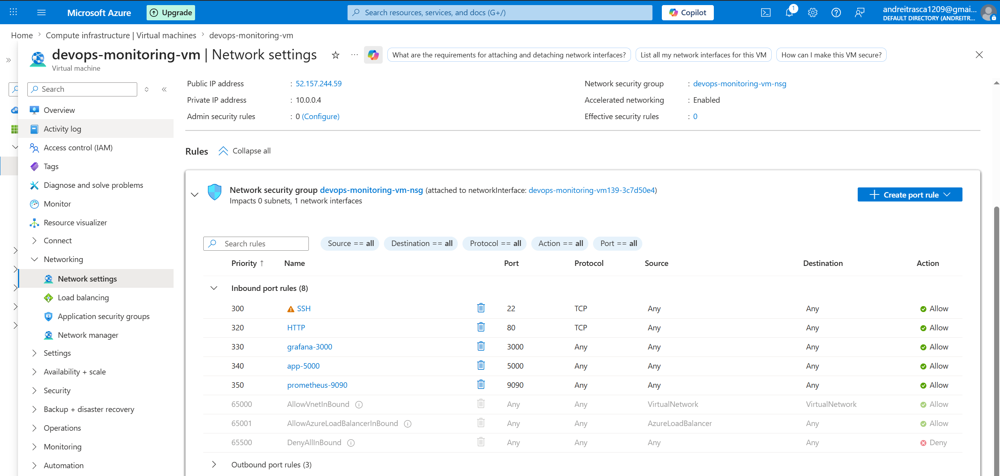

# Cloud DevOps Monitoring Stack

## Overview

This project implements a containerized monitoring stack using Docker Compose.

It includes:

* a Flask web application
* a PostgreSQL database
* Prometheus for metrics collection
* Grafana for dashboard visualization
* automation scripts for host preparation and stack deployment

The goal of the project was to build a reproducible DevOps-style environment that demonstrates service orchestration, observability, and deployment automation.

---

## Architecture

```text
Flask App
   ├── /health
   ├── /db-check
   └── /metrics
        ↓
Prometheus
        ↓
Grafana

Flask App
   ↓
PostgreSQL
```

---

## Tech Stack

* Oracle Linux 9
* Python / Flask
* PostgreSQL
* Docker
* Docker Compose
* Prometheus
* Grafana
* Bash

---

## Features

* Containerized multi-service application stack
* Database connectivity with PostgreSQL
* Prometheus metrics scraping
* Grafana dashboard visualization
* Automated deployment using shell scripts
* Docker volumes for persistent data
* Reproducible setup on Oracle Linux 9

---

## Project Structure

```text
cloud-devops-monitoring-stack/
├── app/
│   ├── app.py
│   ├── Dockerfile
│   └── requirements.txt
├── prometheus/
│   └── prometheus.yml
├── scripts/
│   ├── bootstrap-ol9.sh
│   └── deploy.sh
├── docs/
├── docker-compose.yml
├── .gitignore
└── README.md
```

---

## Application Endpoints

* `/` → basic application response
* `/health` → health check endpoint
* `/db-check` → verifies database connectivity
* `/metrics` → Prometheus metrics endpoint

---

## Monitoring

The application exposes Prometheus metrics through `/metrics`.

Prometheus scrapes the application and Grafana visualizes the collected data.

Example metrics used in the dashboard:

* `app_requests_total`
* `rate(app_requests_total[5m])`

Dashboard panels created:

* **Total requests**
* **Request rate (req/sec)**

---

## Prerequisites

For a fresh Oracle Linux 9 VM, run:

```bash
chmod +x scripts/bootstrap-ol9.sh
./scripts/bootstrap-ol9.sh
```

Then either log out and back in, or run:

```bash
newgrp docker
```

---

## Deployment

Start the full stack with:

```bash
chmod +x scripts/deploy.sh
./scripts/deploy.sh
```

This starts:

* Flask application
* PostgreSQL database
* Prometheus
* Grafana

---

## Access

Default local endpoints:

* App: `http://localhost:5000`
* Prometheus: `http://localhost:9090`
* Grafana: `http://localhost:3000`

Default Grafana credentials:

* Username: `admin`
* Password: `admin`

---

## Example Verification

Check application health:

```bash
curl http://localhost:5000/health
```

Check database connectivity:

```bash
curl http://localhost:5000/db-check
```

---

## Screenshots

### Grafana Dashboard



### Running Containers



### Database Connectivity Check



---

## Key DevOps Concepts Demonstrated

* Containerization
* Multi-service orchestration
* Service-to-service networking
* Persistent storage with Docker volumes
* Metrics collection and observability
* Dashboard-based monitoring
* Deployment automation with shell scripting
* Reproducible environment preparation

---

## Cloud Deployment on Azure

This project was also deployed on a Microsoft Azure virtual machine.

The cloud deployment used an Ubuntu-based Azure VM and reused the same Docker Compose stack from the local environment.

### Azure Deployment Steps

- Provisioned an Ubuntu Azure VM
- Connected to the VM using SSH key authentication
- Installed Docker and Docker Compose
- Cloned this GitHub repository
- Deployed the stack using `scripts/deploy.sh`
- Configured Azure Network Security Group inbound rules

### Azure Network Security Group Rules

The following inbound TCP ports were opened:

| Port | Service |
|------|---------|
| 3000 | Grafana |
| 5000 | Flask application |
| 9090 | Prometheus |

### Ubuntu Bootstrap

For Ubuntu-based systems, the host can be prepared with:

```bash
chmod +x scripts/bootstrap-ubuntu.sh
./scripts/bootstrap-ubuntu.sh
newgrp docker
```

### Infrastructure

- Azure Virtual Machine (Ubuntu)
- Docker + Docker Compose
- Public IP with exposed ports via Network Security Group

### Exposed Services

- Grafana → Port 3000
- Flask App → Port 5000
- Prometheus → Port 9090

### Screenshots

#### Grafana Dashboard (Azure)


#### Azure VM Overview


#### Azure Network Security Rules


---

## Future Improvements

* Deploy the stack to Azure (Done)
* Add NGINX reverse proxy
* Add CI/CD with GitHub Actions
* Add alerting rules in Grafana / Prometheus

